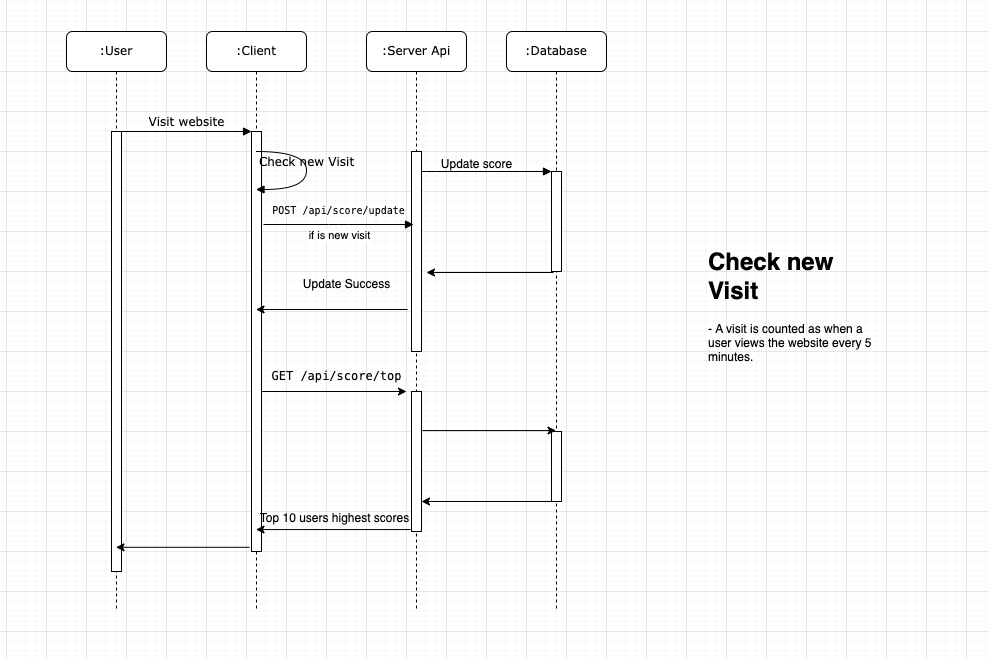

# Scoreboard API Service Specification

## Overview

The Scoreboard API Service is responsible for handling user score updates and maintaining a real-time leaderboard for a website. This service ensures secure and efficient processing of score updates while preventing unauthorized modifications.

## Features

Maintain a top 10 scoreboard with real-time updates.

Secure API endpoints for updating scores.

Prevent unauthorized score modifications.

Efficient data storage and retrieval.

## API Endpoints

### 1. Update User Score

**Endpoint**: `POST /api/score/update`

Description: Updates the score of a user after they complete an action.

**Request**:

```
{
    "user_id": number,
    "score_increment": 1,
    "auth_token": "string"
}
```

**Response**:

```
{
    "success": true,
    "new_score": 120
}
```

**Security Measures:**

Authentication using a token-based system (JWT or API keys).

Check new Visit: A visit is counted as when a user views the website every 5 minutes.

Rate limiting to prevent abuse.

## 2. Retrieve Top Scores

Endpoint: `GET /api/score/top`

Description: Retrieves the top 10 users with the highest scores.

Response:

```
{
    "leaderboard": [
        { "user_id": 1,"user name 1", "score": 200 },
        { "user_id": 2,"user name 2", "score": 180 }
    ]
}
```

**Optimization Strategies:**

- Cached leaderboard updates to minimize database queries.

- Call api(get top 10 users with the highest scores) every 5 seconds(Can use socket for realtime).

## Flow of Execution

1. User completes an action.

2. The client application sends a POST /api/score/update request.

3. The server authenticates and validates the request.

4. The server updates the user's score in the database.

5. If the user's score qualifies for the leaderboard, update the cache.

6. Clients retrieve the updated leaderboard using GET /api/score/top.

## Security Considerations

- Authentication: JWT tokens to verify requests.

- Rate Limiting: Prevent rapid score updates from the same user.

- Input Validation: Prevent injection attacks or invalid data.

## Future Improvements

- Implement role-based access control (RBAC) for admin score management.

- Use a distributed cache (e.g., Redis) for better performance.

- Add logging and monitoring for suspicious activities.

## Execution Flow Diagram


